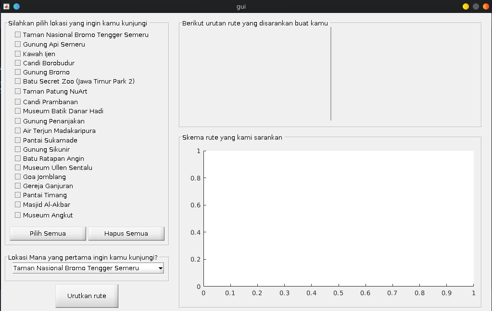

# ant-wisata

## Cara menjalankan

- buka matlab
- buka direktori
- Jalankan dengan perintah
`gui`
- Pilih lokasi yang ingin dikunjungi
- Pilih lokasi pertama yang ingin dikunjungi
- Klik tombol "Urutkan Rute"
- Maka rute yang disarankan akan muncul di bagian kanan 

## ScreenShot
| Pertama kali dijalankan | Hasil Rekomendasi |
| --------- | --------- |
|  |  |
